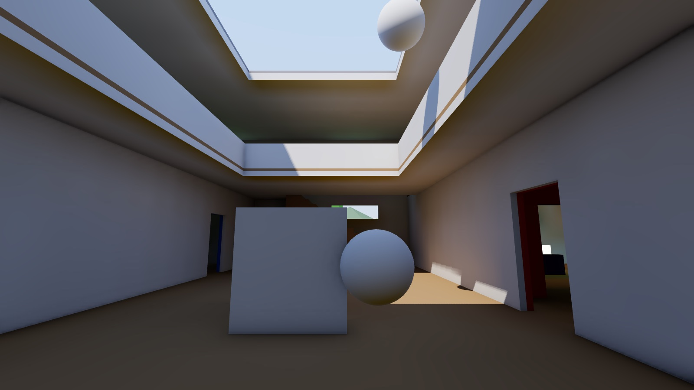
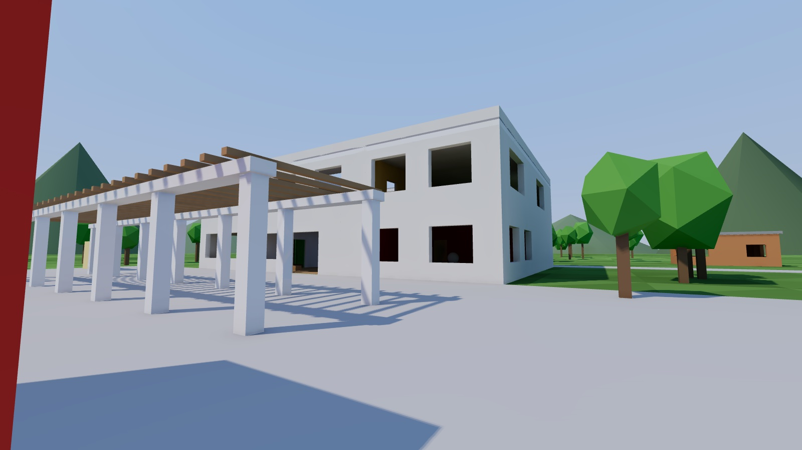
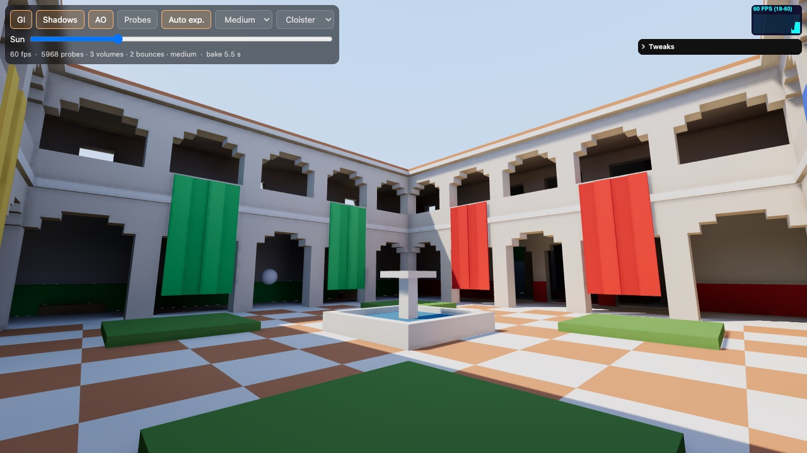
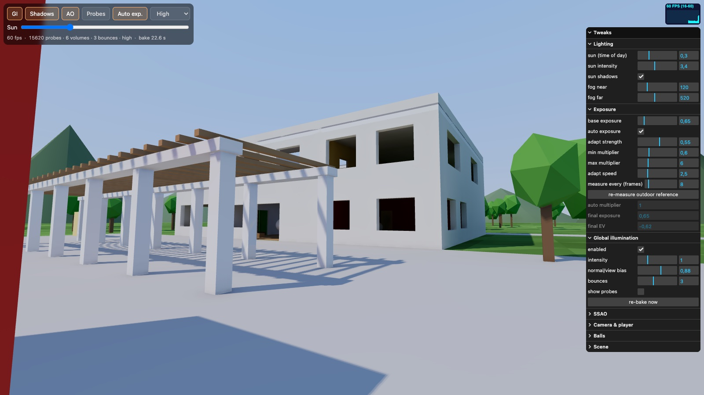

# three.js Probe-Volume GI demo

Two walkable indoor/outdoor scenes lit by dynamic diffuse global illumination (GI) from **irradiance probe volumes that are baked on the GPU at boot**. You can walk them on desktop and on mobile.

**Live demo: https://vvanghelue.github.io/threejs-probe-gi/** (try `?quality=high` on a desktop GPU)



| Campus exterior | Cloister (`?scene=cloister`) | Tweaks panel |
| --- | --- | --- |
|  |  |  |

```bash
npm install
npm run dev        # http://localhost:5173 (also exposed on LAN for phones)
npm run build
```

URL options: `?scene=campus|cloister` (default `campus`), `?quality=low|medium|high` (mobile defaults to `low`), `?ao=debug` shows the AO term alone. The scene and quality can also be switched from the HUD or the Tweaks panel (both reload the page).

## What is in it

- **Scenes** (`src/scenes/`), each a self-contained definition (geometry builder, probe volumes, spawn, auto-exposure reference point, static shadow map extent, fog, animated spheres, default time of day). All static geometry is merged into a single mesh (vertex albedo plus per-vertex emissive), so each capture is one draw call per cube face.
  - **Campus** (default): a two-storey building (colored rooms, an atrium with a skylight, stairs, an ochre gallery). One windowless "glow room" is lit only by emissive panels, so its light is pure GI. There are also 4 small houses, a slatted pergola, colored sculptures, about 90 trees and distant hills.
  - **Cloister**: a Sponza-like open-air courtyard (checker tiles, fountain, lawns) ringed by two-storey arcaded galleries with a stair to the upper level. Colored drapes and dado bands bleed into the shaded galleries. A tall hall off the north gallery never gets direct sun (lit through doorways from the galleries and north-facing clerestory windows), and a crypt below it, reached by a stair that turns a corner, is lit only by emissive lanterns, candles and a brazier. It uses 3 probe volumes (about 6000 probes on medium).
- **Probe volumes** (`src/gi.js`): a coarse global grid plus fine local grids around each interior. At shading time the fine grids blend over the coarse one.
- **Runtime bake** at boot, spread over frames with a progress bar. For every probe:
  1. render a 16² HDR cubemap: direct sun with shadows, sky, emissive, and the previous bounce's GI. Hit distance goes in alpha.
  2. project it to **L1 spherical harmonics** in a single-pixel MRT write (3 × RGBA16F atlases).
  3. on the first bounce, write a 16×16 octahedral **mean/mean² distance tile**.
  4. repeat for N bounces; ping-pong between 3 atlases so a re-bake never flickers.
- **Leak prevention** (DDGI-style): probes stuck inside solid geometry are relocated. Shading uses 8-probe trilinear interpolation weighted by a backface wrap term and **Chebyshev visibility** from the distance tiles, plus a normal/view bias.
- **Shading**: probe irradiance is injected into `MeshStandardMaterial` via `onBeforeCompile`, so the standard PBR pipeline is kept. Moving objects (the spheres and the thrown balls) also receive GI from the volumes, with a cheap GI-based specular term.
- **Cascaded sun shadows** (`src/sun.js`): 2–3 cascades (e.g. 7 m / 22 m / 70 m radius) follow the camera. They are texel-snapped, re-rendered every frame (so moving objects cast shadows too), and blend at their borders. A static 160 m map is re-rendered only when the sun moves; the probe bake uses it, and so does anything beyond the last cascade. The sun is applied directly in the shader, so no three.js light is used.
- **SSAO** (`src/ao.js`): all at half resolution. A depth pre-pass, then AO rebuilt from depth (6/8/12 spiral samples per preset, rotated by a 4x4 pattern, with a range falloff so no halos), then one 4x4 depth-aware blur that fully cancels the pattern noise. The lit materials upsample it with a depth-aware bilateral filter and apply it to the indirect (GI) light, plus 20% of direct.
- **Auto exposure**: a 1-pixel pass measures probe irradiance at the eye, so walking indoors adapts the exposure.
- **Sun slider**: moves the sun (time of day) and re-bakes the probes in the background while you keep walking.

## Controls

- Desktop: click to lock the mouse, **WASD**/arrows to move, **Shift** to run, **Space** to jump, **click** (once the mouse is locked) or **F** to throw a white ball.
- Mobile: left thumb is a virtual joystick (push to the edge to run), right thumb drags to look, the ⤒ button jumps, the ● button throws a ball.

HUD: toggle GI, sun shadows (turning them off also skips rendering the per-frame cascades; the bake keeps the static map), SSAO, show the probes (spheres shaded with their SH), toggle auto exposure, change the quality preset and the scene.

Tweaks panel (lil-gui, top right, collapsed by default on mobile) with an FPS / ms meter (stats.js) above it:

- **Lighting**: sun time of day, sun intensity, sun shadows, fog. Sun changes re-bake the probes when you release the slider.
- **Exposure**: base exposure and auto exposure (adapt strength, min/max multiplier, adapt speed, measurement interval, re-measure the outdoor reference), plus live read-outs of the multiplier and final EV.
- **Global illumination**: on/off, intensity, normal/view bias, bounces, show probes, re-bake.
- **SSAO**: on/off, radius, intensity, share on direct light, max pixel radius, fade distance, AO-only view.
- **Camera & player**, **Balls**, **Scene**: FOV, walk/run/jump speed, ball settings, sphere animation, pixel ratio, scene, quality preset.

## Files

| file | role |
| --- | --- |
| `src/gi.js` | probe volumes, GPU bake (cube capture → SH / depth), shader injection, debug and meter |
| `src/scene.js` | shared procedural builder (boxes, walls with openings, slabs with holes, colliders), color palette, ground/hill helpers, scene definition format |
| `src/scenes/index.js` | scene registry used by `?scene=` |
| `src/scenes/campus.js` | Campus scene (building, houses, pergola, trees) |
| `src/scenes/cloister.js` | Cloister scene (courtyard, galleries, hall, crypt) |
| `src/controls.js` | keyboard/mouse/touch input, capsule-vs-AABB walking with stairs and gravity |
| `src/balls.js` | throwable white balls: one InstancedMesh on the dynamic layer, sphere-vs-AABB / ball-ball physics |
| `src/ao.js` | half-res SSAO (depth pre-pass, AO, bilateral blur) and its material injection |
| `src/main.js` | renderer, sky and sun, scene selection + volumes setup, bake scheduling, UI, loop |

## Deployment

Every push to `main` builds the site and publishes `dist/` to GitHub Pages (`.github/workflows/pages.yml`). `vite.config.js` uses a relative `base`, so the same build also works from any sub-path.
